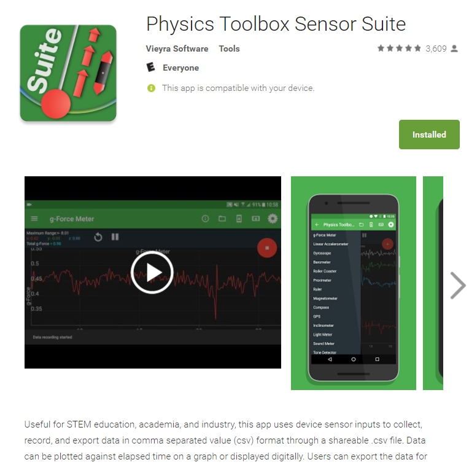
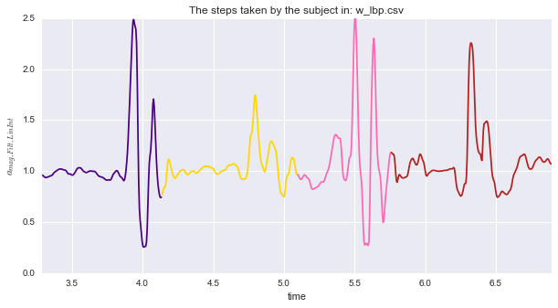
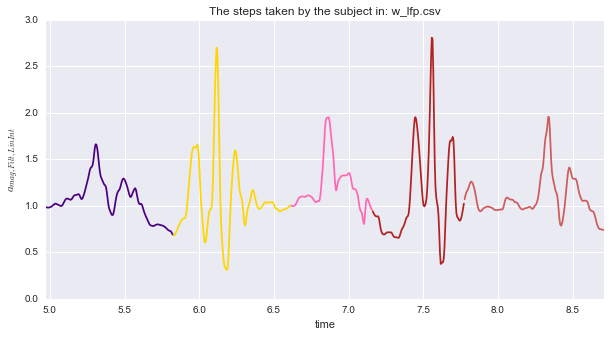
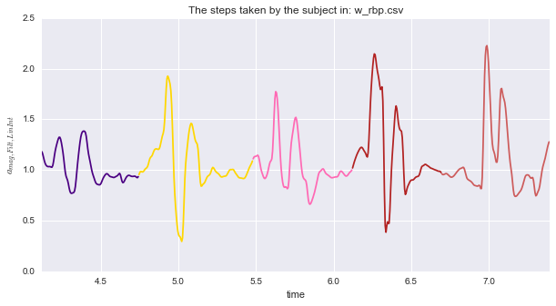
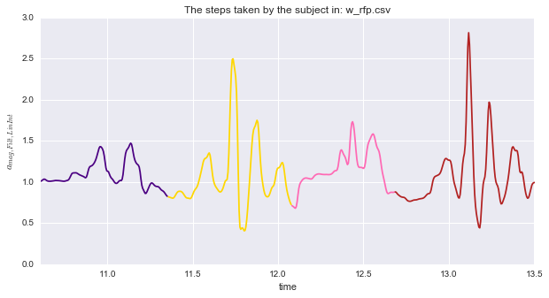

# Walk-cycles-and-accelerometry
Vizualizing Walking data via accelerometry


# Import all the Python packages needed


```python
import pandas as pd
import numpy as np
#############################################################
! pip install plotly --upgrade
from plotly import __version__
from plotly.offline import plot,download_plotlyjs,init_notebook_mode, plot_mpl, iplot
import plotly.tools as tls
print __version__ # requires version >= 1.9.0
init_notebook_mode() # run at the start of every ipython notebook to use plotly.offline
                     # this injects the plotly.js source
import plotly.plotly as py
import plotly.graph_objs as go
from IPython.display import Image
#############################################################
#############################################################
from scipy.signal import argrelmin,butter, filtfilt, medfilt,freqz
from scipy.interpolate import interp1d
from scipy import array
from scipy.fftpack import fft as sp_fft
from scipy.stats import zscore as sp_zscore
%matplotlib inline
```

    Requirement already up-to-date: plotly in c:\toolkits\anaconda2-4.1.0\lib\site-packages
    Requirement already up-to-date: six in c:\toolkits\anaconda2-4.1.0\lib\site-packages (from plotly)
    Requirement already up-to-date: decorator in c:\toolkits\anaconda2-4.1.0\lib\site-packages (from plotly)
    Requirement already up-to-date: pytz in c:\toolkits\anaconda2-4.1.0\lib\site-packages (from plotly)
    Requirement already up-to-date: nbformat>=4.2 in c:\toolkits\anaconda2-4.1.0\lib\site-packages (from plotly)
    Requirement already up-to-date: requests in c:\toolkits\anaconda2-4.1.0\lib\site-packages (from plotly)
    Requirement already up-to-date: ipython-genutils in c:\toolkits\anaconda2-4.1.0\lib\site-packages (from nbformat>=4.2->plotly)
    Requirement already up-to-date: traitlets>=4.1 in c:\toolkits\anaconda2-4.1.0\lib\site-packages (from nbformat>=4.2->plotly)
    Requirement already up-to-date: jsonschema!=2.5.0,>=2.4 in c:\toolkits\anaconda2-4.1.0\lib\site-packages (from nbformat>=4.2->plotly)
    Requirement already up-to-date: jupyter-core in c:\toolkits\anaconda2-4.1.0\lib\site-packages (from nbformat>=4.2->plotly)
    Requirement already up-to-date: enum34; python_version == "2.7" in c:\toolkits\anaconda2-4.1.0\lib\site-packages (from traitlets>=4.1->nbformat>=4.2->plotly)
    Requirement already up-to-date: functools32; python_version == "2.7" in c:\toolkits\anaconda2-4.1.0\lib\site-packages (from jsonschema!=2.5.0,>=2.4->nbformat>=4.2->plotly)
    2.0.7
    

# Some simple signal processing functions:


```python
def lowpass_filter_butterworth(x_in, f_c, f_s, order):
    b, a = butter(order, f_c/ (0.5 * f_s), btype='low', analog=False)
    x_out = filtfilt(b, a, x_in)
    return x_out

def highpass_filter_butterworth(x_in, f_c, f_s, order):
    b, a = butter(order, f_c/ (0.5 * f_s), btype='high', analog=False)
    x_out = filtfilt(b, a, x_in)
    return x_out

def bandpass_filter_butterworth(x_in,f_c_low,f_c_high,f_s,order):
    b, a = butter(order, [f_c_low/ (0.5 * f_s), f_c_high/ (0.5 * f_s)], btype='band', analog=False)
    x_out = filtfilt(b, a, x_in)
    return x_out
# Extrapolation code from: 
# http://stackoverflow.com/questions/2745329/how-to-make-scipy-interpolate-give-an-extrapolated-result-beyond-the-input-range
def extrap1d(interpolator):
    xs = interpolator.x
    ys = interpolator.y

    def pointwise(x):
        if x < xs[0]:
            return ys[0]+(x-xs[0])*(ys[1]-ys[0])/(xs[1]-xs[0])
        elif x > xs[-1]:
            return ys[-1]+(x-xs[-1])*(ys[-1]-ys[-2])/(xs[-1]-xs[-2])
        else:
            return interpolator(x)

    def ufunclike(xs):
        return array(map(pointwise, array(xs)))

    return ufunclike

def extrapolate_1d(time_in,values_in,time_uniform,kind='linear'):
    f_x = extrap1d(interp1d(time_in,values_in, kind))
    values_out =f_x(time_uniform)
    return values_out
#############################################################
# Simple helper function for mining the timestamps of key-stroke presses:
import time

def obtainTimestamps():
    ts = []
    while True:
        input = raw_input("Enter to continue. n to stop: ")
        if "n" in input.lower():
            break
        currentTime = time.time()
        ts.append(np.float(currentTime))
    
    return ts
```

# Getting the raw values right from your phone:
Our app of choice is this:

Downloadable from : https://play.google.com/store/apps/details?id=com.chrystianvieyra.physicstoolboxsuite&hl=en


# Looking at the raw values:


```python
def viz_raw(file_name):
    df_a=pd.read_csv(os.getcwd()+'\\Data\\'+file_name)
    iplot([{"x": list(df_a.time), "y": list(df_a.gFx),'name':'X-axis'},{"x": list(df_a.time), "y": list(df_a.gFy),'name':'Y-axis'},{"x": list(df_a.time), "y": list(df_a.gFz),'name':'Z-axis'}])
file_name='w_lfp.csv'
viz_raw(file_name)
```


# We did a bunch of experiments and recorded the heel-strike times using the ``` obtainTimestamps() ``` function which are saved in the ``` wc_groundtruth_observed ``` dictionary

Key w_lbp implies that the walks were conducted with phone in *l*eft *b*ack *p*ocket


```python
wc_groundtruth_observed={
'w_lfp':{'loc':'lfp','ts':[ 4.97399998,  5.82200003,  6.61400008,  7.15799999, 7.77400017,  8.71000004]},
'w_lbp':{'loc':'lbp','ts':[ 3.28600001,  4.13400006,  5.0940001 ,  5.75800014, 6.89500022]},
'w_rfp':{'loc':'rfp','ts':[10.60900021,  11.352     ,  12.08000016,12.68300009,  13.50400019]},
'w_rbp':{'loc':'rbp','ts':[ 4.12099981,  4.74399996,  5.48000002,  6.11999989, 6.69599986,  7.39199996]}
}
```

# A simple vizualization helper function:


```python
from matplotlib.colors import cnames

def viz_steps(file_name,ts_vec,i_plot=1,f_s=200,f_min=0,f_max=40,order_filt=3):
    #################
    df_a=pd.read_csv(os.getcwd()+'\\Data\\'+file_name)
    ts_max=max(df_a.time)
    time_uniform=np.linspace(0,ts_max,np.ceil(f_s*ts_max))
    df_a_if=pd.DataFrame(data=time_uniform,columns=['time'])
    axes=df_a.columns[1:]
    for axis in axes:
        a_int=extrapolate_1d(df_a.time,df_a[axis],time_uniform,kind='linear')
        if(f_min==0):
            a_filt= lowpass_filter_butterworth(a_int,f_max,f_s,order_filt)
        elif(f_max==np.inf):
            a_filt=highpass_filter_butterworth(a_int,f_min,f_s,order_filt)
        else:
            a_filt=bandpass_filter_butterworth(a_int,f_min,f_max,f_s,order_filt)

        df_a_if['a_'+axis]=a_filt

    df_a_if['a_mag']=np.sqrt(df_a_if.iloc[:,1]**2+df_a_if.iloc[:,2]**2+df_a_if.iloc[:,3]**2)

    #############
    fig=plt.figure(figsize=(10,5))
    color_vec=cnames.keys()# To maintrain consistency across multiple plots
    for i in range(len(ts_vec)-1):
        df_i=df_a_if.ix [(df_a_if.time>=ts_vec[i])&(df_a_if.time<=ts_vec[i+1]),['time','a_mag']]
        plt.plot(df_i.time,df_i.a_mag,color=color_vec[i])
    plt.xlabel('time')
    plt.ylabel('$a_{mag,Filt,LinInt}$')
    plt.title('The steps taken by the subject in: '+str(file_name))
    plt.xlim([min(ts_vec),max(ts_vec)])
    plt.show()
    #############
    if(i_plot==1):
        iplot([{"x": list(df_a_if.time), "y": list(df_a_if.a_mag),"name": 'RSS signal of the interpolated and filtered signal'},{"x": list(ts_vec), "y": list(1*np.ones(len(ts_vec))),"name": 'Heel contact instants'}])
    return None
#########################################
file_name='w_lfp.csv'
ts_vec=wc_groundtruth_observed[file_name.replace('.csv','')]['ts']
viz_steps(file_name,ts_vec,0)        
```


```python
from os import listdir

def find_csv_filenames( path_to_dir, suffix=".csv" ):
    filenames = listdir(path_to_dir)
    return [ filename for filename in filenames if filename.endswith( suffix ) ]
```


```python
file_list=find_csv_filenames(os.getcwd()+'\\Data\\', suffix=".csv" )
for file_name in file_list:
    ts_vec=wc_groundtruth_observed[file_name.replace('.csv','')]['ts']
    viz_steps(file_name,ts_vec,0)          
```













